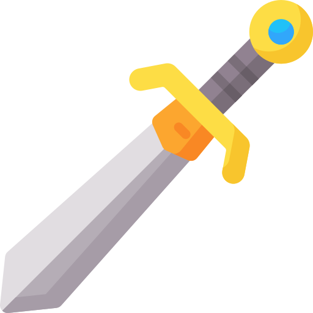
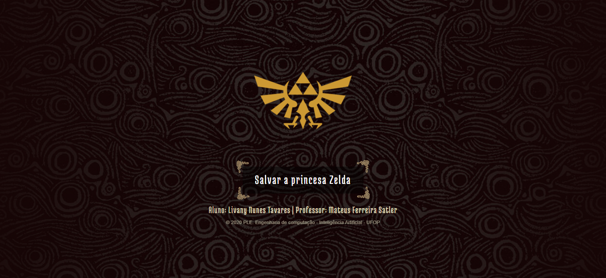
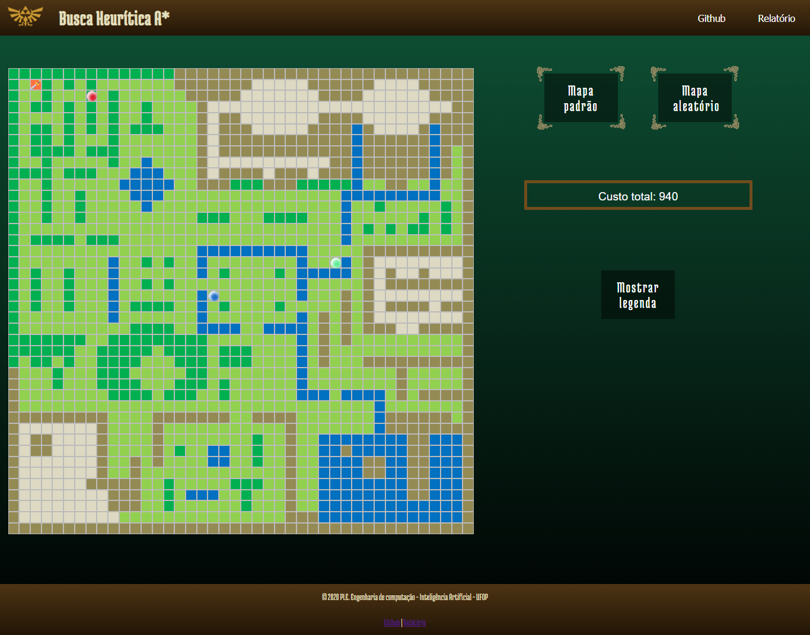

#  Heuristic Search

> The work consists of implementing an agent capable of moving
> autonomously through the kingdom of Hyrule and gather the three Pendants of Virtue. For
> this, you must use the _A* heuristic search algorithm_.
> The agent must be able to automatically calculate the best route to gather the
> three pendants of virtue and go to Lost Woods, where the Master is located
>Sword.

After killing the king of Hyrule, the wizard Agahnim is keeping Princess Zelda
prisoner and intends to break the seal that keeps the evil Ganon imprisoned in the
Dark World.
Link is the only warrior capable of defeating the wizard Agahnim, saving Princess Zelda and
bring peace to the kingdom of Hyrule.

However, the only weapon strong enough to
defeating the wizard Agahnim is the Legendary Master Sword (Figure 1), which is found
trapped on a pedestal in the Lost Woods.

Figure 1 - Legendary Master Sword

To prove himself worthy of wielding the Master Sword, Link must find and gather
the three Pendants of Virtue: courage, power and wisdom (Figure 2). The three
icicles are found throughout the kingdom of Hyrule.

    

        
Courage

        

        
        

    

    

        
Power

        

        
        

    

    

        
Wisdom

        

        
        

    

Figure 2 - Pendants

Your goal is to find the three pendants of virtue and then go to Lost
Woods to the legendary Master Sword.

Figure 3 - Initial page

Figure 3 - Game's page

## How to run the application

In the project folder, right-click on the _index.html_ file and choose your preferred browser to open the file.

## About the project

The work was done using JavaScript, jQuery, HTML and CSS technologies. The search method implemented was A*, with the heuristic function of [Manhattan ](https://theory.stanford.edu/~amitp/GameProgramming/Heuristics.html).

## Terrain options

The player can choose two categories of maps:
1. The default map, or
2. A random map.

## Position of elements

In each new game, the pendants appear in random places, only the Link agent has a fixed starting position. The Master Sword does not change its position.

## Game theme

The model of the buttons and pages were inspired by the game [The Legend of Zelda](https://www.nintendo.pt/Jogos/Portal-Nintendo/Portal-The-Legend-of-Zelda/Portal-The-Legend-of-Zelda-627606.html)
